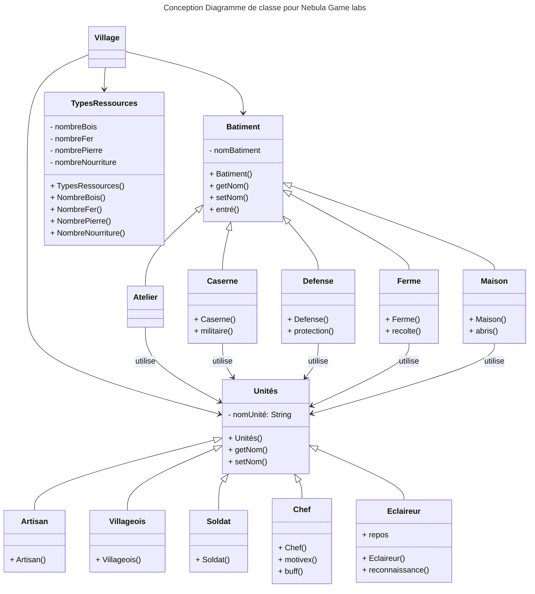

```mermaid
---
title: Conception Diagramme de classe pour Nebula Game labs
---
classDiagram
    Village --> Batiment
    Village --> Unités
    Village --> TypesRessources

    Batiment <|-- Atelier
    Batiment <|-- Caserne
    Batiment <|-- Defense
    Batiment <|-- Ferme
    Batiment <|-- Maison

    class Batiment {
        - nomBatiment
        + Batiment()
        + getNom()
        + setNom()
        + entré()
    }

    class Caserne {
        + Caserne()
        + militaire()
    }

    class Defense {
        + Defense()
        + protection()
    }

    class Ferme {
        + Ferme()
        + recolte()
    }

    class Maison {
        + Maison()
        + abris()
    }

    Unités <|-- Artisan
    Unités <|-- Villageois
    Unités <|-- Soldat
    Unités <|-- Chef
    Unités <|-- Eclaireur

    class Unités {
        - nomUnité: String
        + Unités()
        + getNom()
        + setNom()
    }

    class Artisan {
        + Artisan()
    }

    class Chef {
        + Chef()
        + motivex()
        + buff()
    }

    class Eclaireur {
        + Eclaireur()
        + reconnaissance()
        + repos
    }

    class Soldat {
        + Soldat()
    }

    class Villageois {
        + Villageois()
    }

    class TypesRessources {
        - nombreBois
        - nombreFer
        - nombrePierre
        - nombreNourriture
        + TypesRessources()
        + NombreBois()
        + NombreFer()
        + NombrePierre()
        + NombreNourriture()
    }

    Atelier --> Unités : utilise
    Caserne --> Unités : utilise
    Defense --> Unités : utilise
    Ferme --> Unités : utilise
    Maison --> Unités : utilise

```
