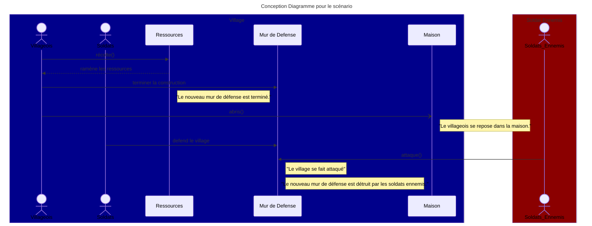

```mermaid
---
title: Conception Diagramme pour le scénario
---
sequenceDiagram
    box Darkblue Village
    actor Villageois
    actor Soldats
    participant Ressources
    participant Mur de Defense
    participant Maison
    participant Soldats
    end

    box Darkred Soldat Ennemis
    actor Soldats_Ennemis
    end

    Villageois ->> Ressources: récolte()
    Ressources -->> Villageois: ramène les ressources

    Villageois ->> Mur de Defense: terminer la construction
    note left of Mur de Defense: "Le nouveau mur de défense est terminé."

    Villageois -) Maison: abris()
    note right of Maison: "Le villageois se repose dans la maison."

    Soldats ->> Mur de Defense : defend le village
    Soldats_Ennemis ->> Mur de Defense: attaque()
    note right of Mur de Defense : "Le village se fait attaqué"
    note right of Mur de Defense: "Le nouveau mur de défense est détruit par les soldats ennemis."

```
